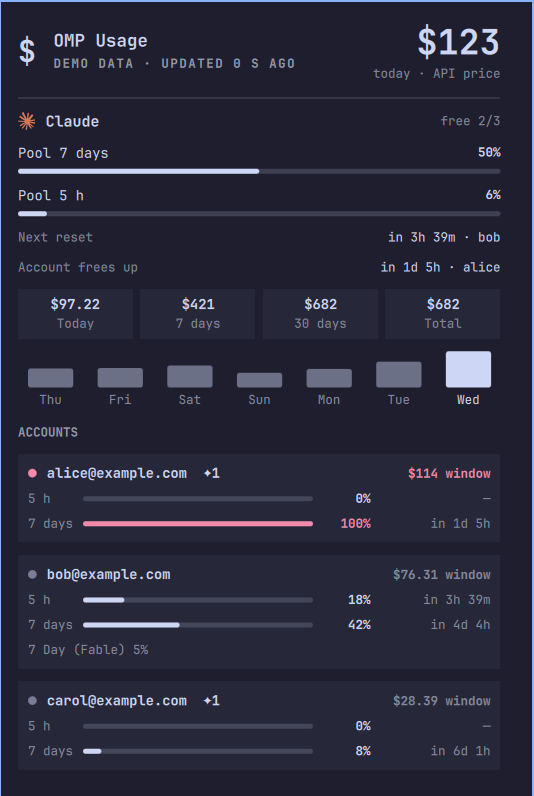

# OMP Usage for Omarchy

Omarchy bar widget showing subscription usage for every provider and account logged in to [oh-my-pi](https://github.com/can1357/oh-my-pi) (`omp`), with reset times and the API-equivalent cost of what you used.

It covers every provider `omp usage` reports on: Claude, Codex, Gemini CLI, Antigravity, Copilot, Cursor, Grok, Kimi Code, Z.ai, Zhipu, MiniMax, Alibaba, OpenCode Go, Cline, Devin, Firepass, Ollama Cloud, Synthetic, and any provider OMP adds later. Providers that report a quota show up in the bar. Pay-as-you-go APIs you used through OMP (OpenRouter, OpenAI, Gemini API, DeepSeek, …) appear in the panel with their spend only.



*Screenshot uses the built-in demo data.*

The UI follows the system language (`LANGUAGE` / `LC_ALL` / `LC_MESSAGES` / `LANG`): English, Čeština, Slovenčina, Deutsch, Polski, Русский, Українська, Français, Español, Italiano, Português, Nederlands, 日本語, 中文. Other languages fall back to English. Numbers, dates and weekday names use the same locale.

## Install

```bash
omarchy plugin add https://github.com/iamanro/omarchy-omp-usage.git --enable
```

Requirements: `omp` logged in to at least one Anthropic or OpenAI Codex subscription, and `/usr/bin/python3` (standard library only).

## What it shows

- **Bar:** one icon + pool usage per provider with a quota, i.e. the share of the combined quota of all that provider's accounts already used in the fullest window (same as the `capacity` line of `omp usage`). Providers that only report per-model buckets (Gemini CLI, Antigravity) count their fullest bucket. Providers without a logo get a monogram. It turns the urgent colour at `alertPercent` or when every account is exhausted. Hover for a summary, right-click to refresh.
- **Panel:** for each provider:
  - pool meters per window (5 h / 7 days)
  - next reset and when the next exhausted account frees up
  - API-equivalent cost for today / 7 days / 30 days / total, plus a 7-day chart
  - every account with its limit windows, reset countdowns and saved reset credits (`✦N`), and the cost of its current window (hover for more)
  - spend that can't be attributed to an account
  - top models over the last 7 days

## Data and privacy

Everything stays on your machine. `bin/omp_usage.py snapshot` combines:

- `omp usage --json` for limit windows;
- the API price OMP records on every assistant message in `~/.omp/agent/sessions` (`usage.cost.total`);
- `credentialId` on those messages, mapped to an account e-mail through `~/.omp/agent/agent.db`, opened read-only. Messages from before OMP started recording `credentialId`, and those from removed accounts, are listed as unattributed.

The logs are indexed incrementally into `~/.cache/omp-usage/index.db`. The first run reads everything (a few seconds per GB); later snapshots only read appended lines. Deleting the cache is safe: it gets rebuilt.

For screen sharing, enable `hideEmails`. For screenshots, enable `demoMode`: it shows invented accounts and reads nothing local.

## Settings

Set them with `omarchy bar set iamanro.omp-usage <key> <value> --json`:

| key | default | |
|---|---|---|
| `refreshIntervalSec` | `120` | snapshot interval; opening the panel always refreshes |
| `ompCommand` | `"omp"` | name on PATH or absolute path of `omp` |
| `alertPercent` | `90` | pool usage that turns the provider urgent |
| `showCostInBar` | `false` | also show today's cost in the bar |
| `hideEmails` | `false` | mask e-mails (`a•••@e•••.com`) and organisation names |
| `demoMode` | `false` | invented data for screenshots |
| `language` | `"auto"` | `auto` or a code: `en cs sk de pl ru uk fr es it pt nl ja zh` |

Translations live in `I18n.js`. To add a language, copy the `en` block. Missing keys fall back to English.

## Development

```bash
python3 -m unittest discover -s tests   # helper tests
bin/omp_usage.py snapshot | jq          # raw snapshot
bin/omp_usage.py snapshot --demo | jq   # demo snapshot
./install.sh                            # copy a working tree into the shell and restart it
```

`install.sh` installs a copy rather than a symlink, because the shell's plugin watcher doesn't follow symlinks. It restarts the shell because already-loaded QML stays cached.

## License

MIT. Provider logos come from [@lobehub/icons-static-svg](https://github.com/lobehub/lobe-icons) (MIT); `claude.svg` and `codex*.svg` come via Omarchy's built-in Agents plugin (MIT). Each logo ships as `<icon>.svg` for dark bars and `<icon>-light.svg` for light ones.
